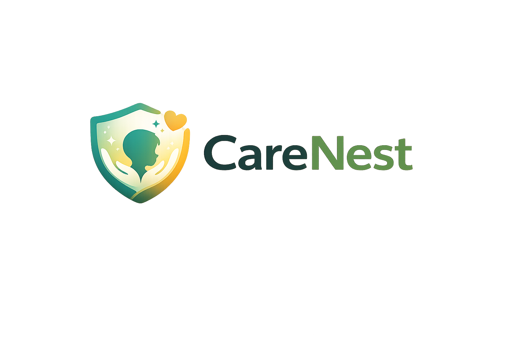

<p align="center">
  
</p>

# CareNest

CareNest is a privacy-preserving early warning system for adolescent mental-health risk. Its focus is not chat surveillance or parental control. The system is designed to help responsible adults, schools, and care pathways detect warning signs earlier and escalate to human support sooner.

This framing is consistent with the project strategy in [docs/hsil_project_aim_focus_updated.md](docs/hsil_project_aim_focus_updated.md): early detection of distress, bullying-related harm, isolation, and other meaningful risk signals, with minimal exposure of private content.

## What The Project Does

The platform analyzes conversations in stages:

1. A conversation is normalized and chunked in memory.
2. A preprocessing layer extracts structured signals such as toxicity, targeting, distress, and emotional tone.
3. An LLM receives the chunk plus structured metrics and recent history.
4. A postprocessing layer decides whether to create or update an alert.
5. Guardians or other recipients see a privacy-preserving dashboard with summaries and metrics instead of raw stored chat content.

The current repository also includes a fully scripted frontend demo mode for presentations. That mode simulates the child chat and guardian dashboard entirely in the UI without needing live backend analysis.

## Architecture

The repository is split into three services:

- `care-database`: PostgreSQL schema for identities, conversation chunks, derived metrics, summaries, risk assessments, and alerts
- `care-backend`: FastAPI service that runs preprocessing, LLM analysis, postprocessing, and notification flows
- `care-ui`: Next.js frontend with guardian and child views plus a scripted demo presentation mode

Supporting documentation:

- [docs/database.md](docs/database.md)
- [docs/preprocessing_layer_design.md](docs/preprocessing_layer_design.md)
- [docs/hsil_project_aim_focus_updated.md](docs/hsil_project_aim_focus_updated.md)

## Privacy Model

The core privacy decision is already reflected in the schema: raw chat messages are intentionally not stored in PostgreSQL. Instead, the database persists:

- users and guardian-child links
- conversations and participants
- time-based conversation chunks
- derived chunk metrics
- privacy-preserving chunk summaries
- risk assessments
- alerts and recipients

See [care-database/init.sql](care-database/init.sql) and [docs/database.md](docs/database.md) for the full model.

## Preprocessing Layer

The preprocessing pipeline is implemented in [care-backend/preprocessing/pipeline.py](care-backend/preprocessing/pipeline.py). It produces structured metrics such as:

- `toxicity`
- `insult_score`
- `emotion.anger`
- `emotion.sadness`
- `emotion.fear`
- `manipulation_similarity`
- `targeting_intensity`
- `dominance_ratio`
- `activity_anomaly`
- `risk_trend`
- `distress_signal`
- `confidence`

### Models currently used

Defined in [care-backend/preprocessing/model_registry.py](care-backend/preprocessing/model_registry.py):

- Toxicity: `cooperleong00/deberta-v3-large_toxicity-scorer`
- Emotion: `AnasAlokla/multilingual_go_emotions`
- Semantic similarity: `all-MiniLM-L6-v2`

Rules and resources:

- distress patterns come from JSON resources in `care-backend/preprocessing/resources/`
- manipulation similarity is embedding-based over curated patterns

The design intent documented in [docs/preprocessing_layer_design.md](docs/preprocessing_layer_design.md) is broadly aligned with the implementation, although the exact production model choices in code are the ones above.

## Backend Analysis Flow

The main orchestration path lives in [care-backend/backend/analysis_orchestrator.py](care-backend/backend/analysis_orchestrator.py).

High-level flow:

1. `preprocess_conversation(...)` computes structured signals
2. the backend stores `chunk_metrics`
3. the LLM runner builds a prompt with:
   - current chunk conversation
   - preprocessing metrics
   - recent historical summaries
4. the backend stores `chunk_summaries`
5. risk assessments are written when the LLM detects relevant risk
6. postprocessing decides whether an alert should be created, updated, or escalated
7. guardian dashboards and notifications are refreshed

### LLM runtime

The LLM runner is implemented in [care-backend/backend/runner.py](care-backend/backend/runner.py).

Runtime behavior:

- if `CARE_API_KEY` is set, the backend uses an OpenAI-compatible API
- otherwise it falls back to AWS Bedrock

Current defaults:

- OpenAI-compatible model: `gpt-4o-mini`
- Bedrock model id: `eu.anthropic.claude-sonnet-4-6`

## Frontend

The frontend lives in `care-ui/` and is built with Next.js.

Two modes matter in practice:

- backend-connected flows for guardian/session/chat APIs
- scripted demo mode for presentations

### Scripted demo mode

The current presentation-ready demo is frontend-only. It does not need live backend analysis to run.

Relevant files:

- [care-ui/app/page.tsx](care-ui/app/page.tsx)
- [care-ui/app/demo-script.ts](care-ui/app/demo-script.ts)
- [care-ui/app/use-demo-simulation.ts](care-ui/app/use-demo-simulation.ts)
- [care-ui/app/demo-date.ts](care-ui/app/demo-date.ts)

What the demo simulates:

- one guardian: `Laura Martinez`
- two children: `Sofia Martinez` and `Diego Ramos`
- a conversation that starts neutral and escalates over several weeks
- guardian metrics that rise in parallel with the conversation
- a floating demo control panel to start, pause, reset, jump phases, and change playback speed

Demo credentials:

- `laura.martinez@care.local / laura123`
- `sofia.martinez@care.local / sofia123`
- `diego.ramos@care.local / diego123`

## API Surface

Current backend routes in [care-backend/api.py](care-backend/api.py):

- `GET /health`
- `GET /api/pacientes`
- `POST /api/pacientes`
- `GET /api/alerts/state`
- `GET /api/session/guardian/{user_id}/dashboard`
- `GET /api/session/catalog`
- `POST /api/session/login`
- `GET /api/session/child/{user_id}/chat`
- `POST /api/session/child/{user_id}/chat/messages`
- `POST /api/alerts/publish`
- `POST /api/analysis/trigger/{conversation_id}`
- `GET /api/push/public-key`
- `POST /api/push/subscribe`
- `DELETE /api/push/subscribe`
- `WS /ws/alerts`

## Running The Project

### Requirements

- Docker
- Docker Compose

### Environment

Create a local env file:

```bash
cp .env.example .env
```

The provided `.env.example` includes basic database and backend URL settings. Depending on how you want to run the LLM layer, you may also need:

- `CARE_API_KEY` for OpenAI-compatible mode
- or valid AWS credentials for Bedrock mode

### Full stack with Docker Compose

From the repository root:

```bash
docker compose up --build
```

Default endpoints:

- UI: `http://localhost:13000`
- Backend: `http://localhost:9010`
- Backend health: `http://localhost:9010/health`
- Database: `localhost:5432`

### Frontend-only demo in Docker

If you only want the scripted UI demo:

```bash
docker build -t care-ui-demo -f care-ui/Dockerfile care-ui
docker run --rm -p 13000:13000 care-ui-demo
```

Then open:

```text
http://localhost:13000
```

## How To Test The Demo

1. Start the UI
2. Open `http://localhost:13000`
3. Log in as `Laura Martinez`
4. Press `Iniciar` in the demo panel
5. Watch the guardian dashboard evolve from low concern to high concern while dates progress across multiple weeks
6. Log out and repeat with `Sofia Martinez` or `Diego Ramos` to view the same conversation from each child perspective

Useful controls during the demo:

- `Iniciar`
- `Pausar`
- `Reiniciar`
- `Fase anterior`
- `Siguiente fase`
- speed selector

## Backend Demo Seed

There is also backend demo seeding logic in [care-backend/api.py](care-backend/api.py) controlled by `CARE_SEED_DEMO`. That path prepares seeded users, relationships, alerts, and example conversation artifacts.

At the moment, for presentations, the frontend scripted demo is the more important and more deterministic path.

## Repository Map

Top-level directories:

- `care-ui/`: Next.js frontend and scripted demo
- `care-backend/`: FastAPI API, preprocessing pipeline, orchestration, postprocessing
- `care-database/`: PostgreSQL schema and DB image
- `docs/`: project rationale and architecture notes
- `assets/`: visual assets including the logo

## Notes

- The schema is re-applied by the backend on startup so older volumes can still be upgraded safely
- The backend Docker image copies `care-database/init.sql` into the service to bootstrap the schema
- The current frontend demo can be presented independently from live backend availability

